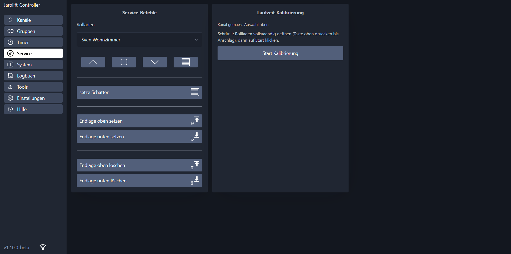
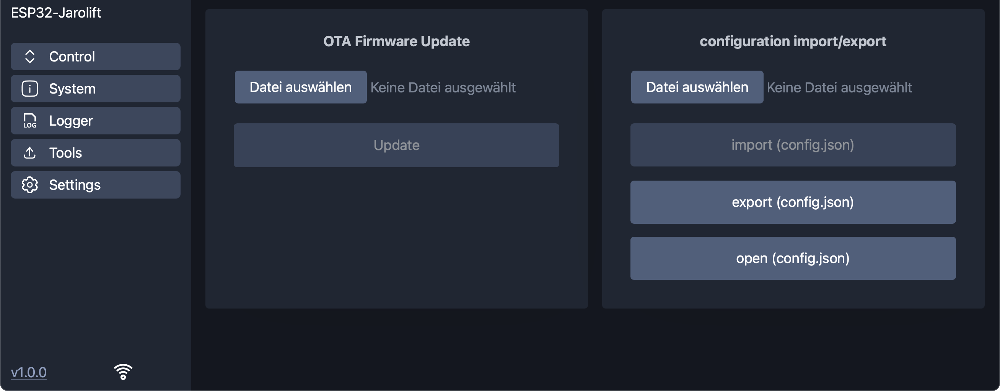
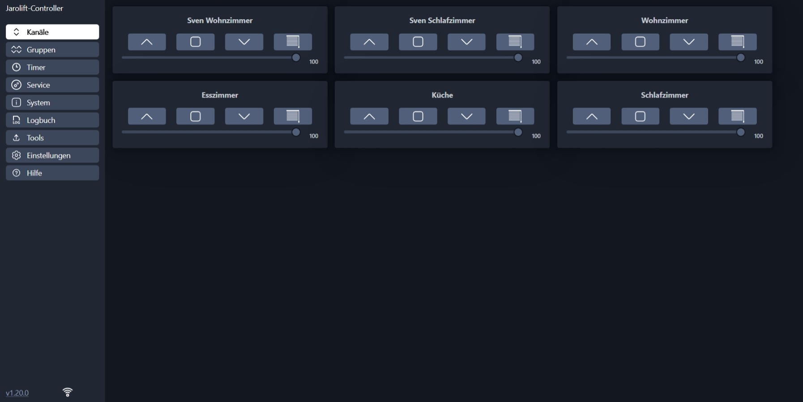
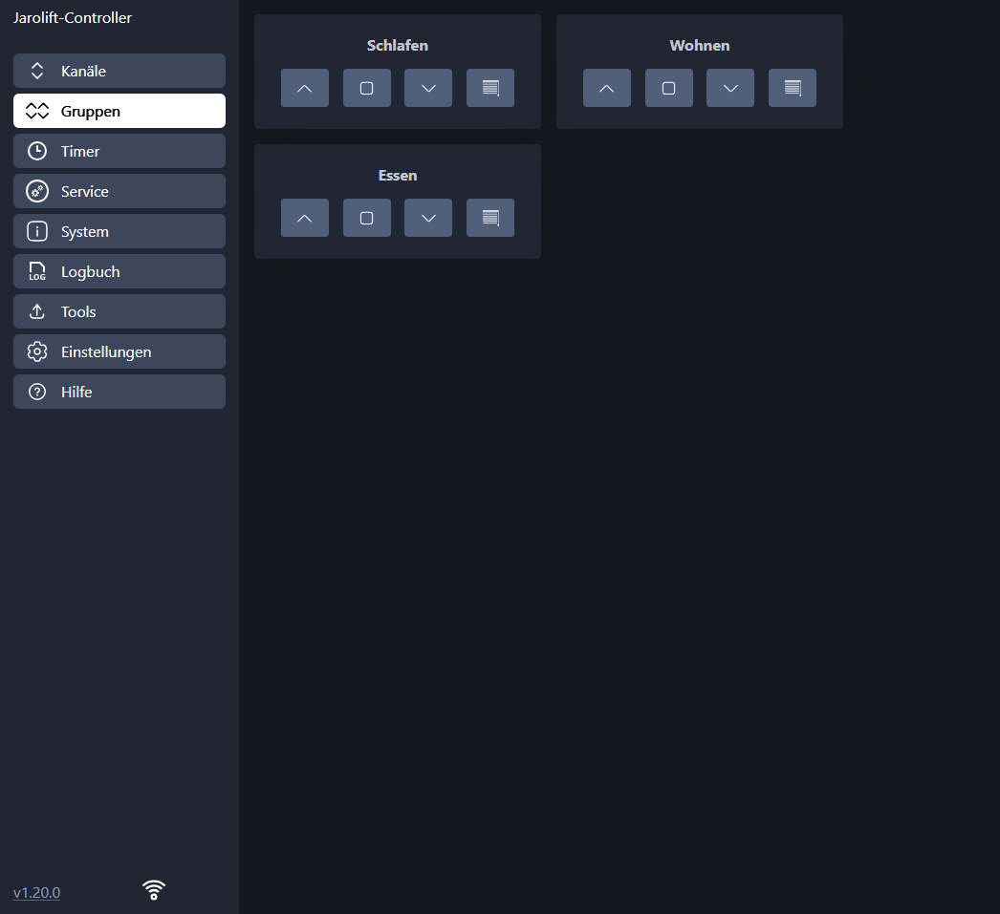
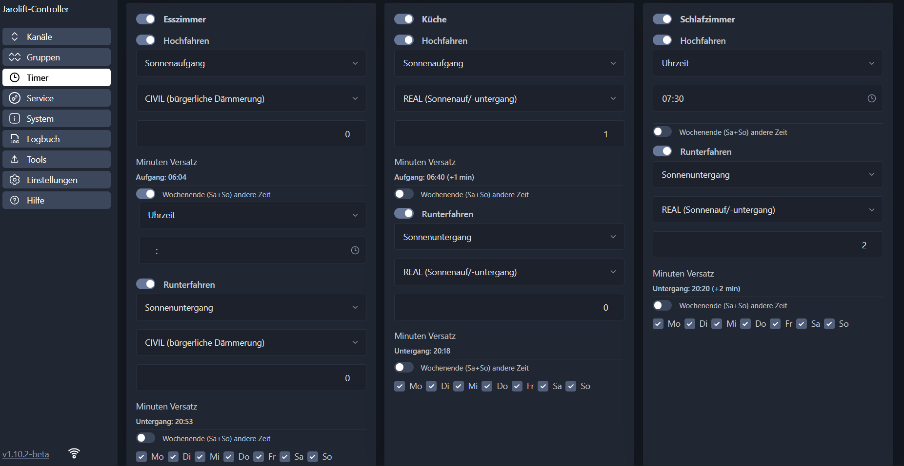
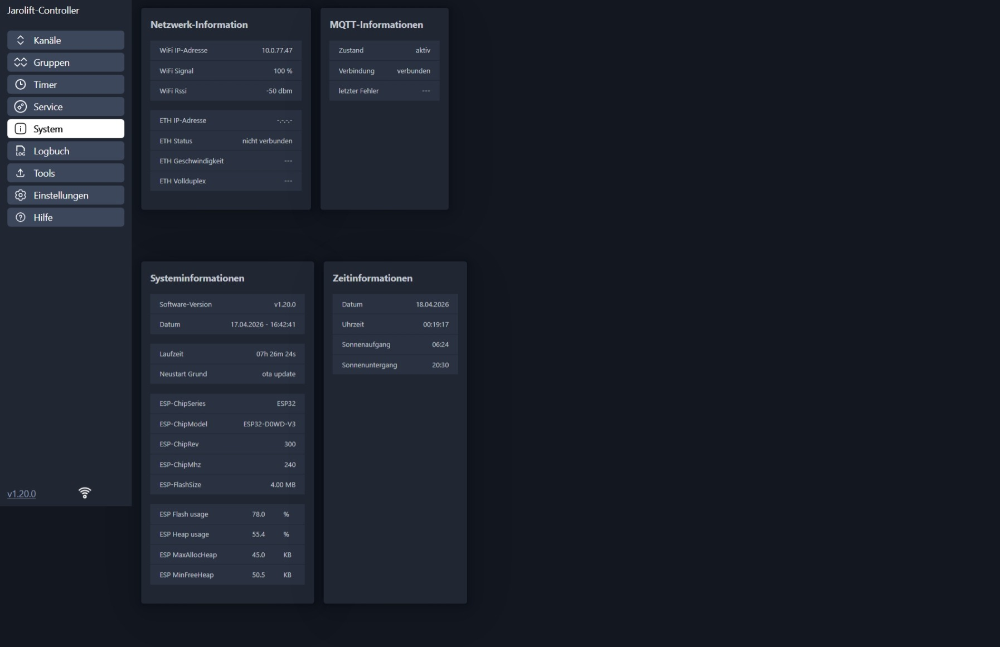

<div align="center">


<h3>ESP32-Jarolift-Controller</h3>

<p><em>Fork von <a href="https://github.com/dewenni/ESP32-Jarolift-Controller">dewenni/ESP32-Jarolift-Controller</a> – erweitert um prozentbasierte Positionssteuerung</em></p>
</div>

-----

**[🇬🇧 English version of this description](README.md)**

-----

<div align="center">

[](https://github.com/Banabas/ESP32-Jarolift-Controller/releases/latest)


[](https://github.com/Banabas/ESP32-Jarolift-Controller/stargazers/)

</div>

-----

# ESP32-Jarolift-Controller

Steuerung von Jarolift(TM) TDEF 433MHz Funkrolläden über **ESP32** und **CC1101** Transceiver-Modul im asynchronen Modus.

> [!NOTE]
> Dies ist ein Fork des hervorragenden Originalprojekts von [dewenni](https://github.com/dewenni/ESP32-Jarolift-Controller).
> Es erweitert das Original um **zeitbasierte Positionssteuerung** für einzelne Rolläden.
> Alle Code-Änderungen in diesem Fork wurden mit Unterstützung von [Claude](https://claude.ai) (Anthropic KI) entwickelt,
> da der Repository-Inhaber keine Programmierkenntnisse besitzt.

-----

## Was ist neu in diesem Fork?

### Prozentbasierte Positionssteuerung

Die wichtigste Neuerung ist die **zeitbasierte Positionssteuerung**.  
Jeder Rollladen kann nun auf eine beliebige Position zwischen 0% (vollständig geöffnet) und 100% (vollständig geschlossen) gefahren werden – direkt über die Weboberfläche, per MQTT oder über Home Assistant.

> **Wie es funktioniert:** Da Jarolift-Motoren ihre tatsächliche Position nicht zurückmelden, misst der Controller wie lange der Motor von vollständig geöffnet bis vollständig geschlossen braucht (und zurück). Anhand dieser kalibrierten Fahrzeit berechnet er genau, wann der Motor gestoppt werden muss, um jede gewünschte Position zu erreichen.

**Besonderheiten der Positionssteuerung:**

- **0–100% Positionsschieberegler** in der WebUI für jeden Kanal
- **Separate Kalibrierung** für die Abwärts- (Schließen) und Aufwärts-Fahrzeit (Öffnen) – da Motoren in beiden Richtungen unterschiedlich schnell fahren
- **Präzises Timing** – der Stoppbefehl wird exakt in dem Millisekunden ausgegeben, in dem der RF-Befehl des Motors gesendet wird
- **Positionsspeicher** – die zuletzt bekannte Position wird im Flash-Speicher gespeichert und nach einem Neustart wiederhergestellt
- **MQTT-Positionssteuerung** – eine Zahl (0–100) als Payload senden, um einen Rollladen auf diese Position zu fahren
- **Home Assistant Integration** – Rolläden erscheinen als Cover-Entitäten mit Positionsschieberegler; Positionen >= 75% werden als "geschlossen" gemeldet, darunter als "geöffnet"


### Kalibrierung

Bevor die Positionssteuerung genutzt werden kann, muss jeder Kanal einmalig kalibriert werden.  
Die Kalibrierung misst die tatsächliche Fahrzeit des Motors in beiden Richtungen.

**Kalibrierungsschritte (Service-Seite):**

1. Kanal im Dropdown auswählen
2. Rollladen vollständig öffnen (Hoch-Taste drücken bis zum Anschlag)
3. Auf **"Start Kalibrierung"** klicken – der Rollladen fährt automatisch nach unten
4. Wenn der Rollladen unten angekommen ist, **"Stopp – Rollladen unten"** klicken
5. Der Rollladen fährt nun automatisch wieder hoch
6. Wenn vollständig geöffnet, **"Stopp – Rollladen oben"** klicken
7. Beide Fahrzeiten werden automatisch gespeichert



> [!TIP]
> Die Kalibrierung muss nur einmal pro Kanal durchgeführt werden. Die gemessenen Fahrzeiten bleiben nach einem Neustart erhalten und werden in der Konfigurationsdatei gespeichert.

### Aktualisierte Home Assistant Discovery

- Jeder Rollladen wird als **Cover-Entität mit Positionsschieberegler** (0–100%) veröffentlicht
- Ein separater **Schatten-Button** wird für jeden Rollladen hinzugefügt
- Statuslogik: Position >= 75% -> `closed`, Position > 0% -> `stopped`, Position = 0% -> `open`
- Positionsbefehle von HA werden automatisch invertiert (ESP32: 0 = offen, 100 = geschlossen)

### Position per MQTT

```text
Befehl:     Rollladen auf Position fahren (0-100%)
Topic:      ../cmd/shutter/1 ... cmd/shutter/16
Payload:    {0 ... 100}   (Ganzzahl, 0 = vollständig offen, 100 = vollständig geschlossen)

Beispiel:   Rollladen 1 auf 50% fahren
Topic:      jarolift/cmd/shutter/1
Payload:    50
```

> [!IMPORTANT]
> Der Kanal muss kalibriert sein, bevor Positionsbefehle funktionieren.
> Positionsbefehle an unkalibrierte Kanäle werden stillschweigend ignoriert.

-----

## Features

- **Webbasierte Benutzeroberfläche (WebUI):**
  Eine moderne, mobilfreundliche Schnittstelle für einfache Konfiguration und Steuerung.

- **Prozentbasierte Positionssteuerung:** *(neu in diesem Fork)*
  Jeden Rollladen auf eine beliebige Position von 0% bis 100% fahren – per Schieberegler, MQTT oder Home Assistant.

- **MQTT-Unterstützung:**
  Kommunikation und Steuerung über MQTT, ein leichtgewichtiges und zuverlässiges Messaging-Protokoll.

- **Home Assistant Integration:**
  Automatische Geräterkennung per MQTT Auto Discovery, inkl. Positionsschieberegler und Schatten-Buttons.

- **Bis zu 16 Rolläden:**
  Steuerung von bis zu 16 Rolläden über WebUI und MQTT.

- **Bis zu 6 Rollladengruppen:**
  Gruppen definieren, um mehrere Rolläden gleichzeitig zu steuern.

- **Timer-Funktion:**
  Jeder Kanal und jede Gruppe hat einen eigenen Timer mit separaten Auf- und Ab-Ereignissen. Unterstützt feste Uhrzeit, Sonnenaufgang/Sonnenuntergang mit konfigurierbarem Astro-Modus (zivil, nautisch, astronomisch, Horizont) sowie optionalem Wochenend-Override.

-----

# Inhaltsverzeichnis

- [Was ist neu in diesem Fork?](#was-ist-neu-in-diesem-fork)
- [Hardware](#hardware)
  - [ESP32](#esp32)
  - [CC1101 433Mhz](#cc1101-433mhz)
  - [Optional: Ethernet Modul W5500](#optional-ethernet-modul-w5500)
- [Erste Schritte](#erste-schritte)
  - [Platform-IO](#platform-io)
  - [ESP-Flash-Tool](#esp-flash-tool)
  - [OTA-Updates](#ota-updates)
  - [Setup-Mode](#setup-mode)
  - [Konfiguration](#konfiguration)
  - [Filemanager](#filemanager)
  - [Anlernen von Rolläden](#anlernen-von-rolläden)
  - [Migration](#migration)
- [WebUI](#webui)
  - [Kanäle](#kanäle)
  - [Gruppen](#gruppen)
  - [Timer](#timer)
- [MQTT](#mqtt)
  - [Kommandos](#kommandos)
  - [Status](#status)
  - [Home Assistant](#home-assistant)
- [Optionale Kommunikation](#optionale-kommunikation)
  - [WebUI-Logger](#webui-logger)
  - [Telnet](#telnet)

-----

# Hardware

Funktionierende Setups von Benutzern dieses Projekts: [funktionierende Setups](https://github.com/Banabas/ESP32-Jarolift-Controller/discussions/34)

## ESP32

Die Firmware ist für folgende Chips verfügbar:

**Standard ESP32 (Xtensa 32-bit LX6, 4MB Flash)**

- `ESP32-WROOM-32 Serie` (z.B. WROOM, WROOM-32D, WROOM-32U)
- `ESP32-WROVER Serie` (z.B. WROVER, WROVER-B, WROVER-IE)
- `ESP32-MINI Serie`
- `ESP32-S2`
- `ESP32-S3`

**Nicht kompatibel:**

- `ESP32-H Serie`
- `YB-ESP32-S3-ETH`
- `WT32-ETH01`

## CC1101 433Mhz

**Kompatible und getestete Produkte:**

- `EBYTE E07-M1101D-SMA V2.0`
- `CC1101 433MHZ Green`

Standard SPI GPIO-Konfiguration:

| CC1101-Signal | ESP-GPIO |
|---------------|----------|
| VCC           | --       |
| GND           | --       |
| GD0           | 21       |
| GD2           | 22       |
| SCK/CLK       | 18       |
| MOSI          | 23       |
| MISO          | 19       |
| CS(N)         | 5        |


Beispiel mit ESP32-Mini und CC1101


Beispiel für direkten Austausch mit ESP32-Mini und dem Custom Board von M. Maywald

## Optional: Ethernet Modul W5500

Es ist möglich, ein W5500 Ethernet-Modul anzuschließen.

**Kompatible und getestete Produkte:**

- `W5500` HanRun (HR911105A)
- `W5500 Lite` HanRun (HR961160C)

> [!IMPORTANT]
> Das Anschlusskabel sollte so kurz wie möglich sein (ca. 10 cm).

Beispiel für generischen ESP32-Mini (Standard-SPI wird vom CC1101 verwendet):

| Signal | GPIO |
|--------|------|
| CLK    | 25   |
| MOSI   | 26   |
| MISO   | 27   |
| CS     | 32   |
| INT    | 33   |
| RST    | 17   |

-----

# Erste Schritte

## Platform-IO

Die Software wurde mit [Visual Studio Code](https://code.visualstudio.com) und dem [pioarduino-Plugin](https://github.com/pioarduino/pioarduino-vscode-ide) erstellt.  
Das Projekt von GitHub klonen oder als ZIP herunterladen und in PlatformIO öffnen.  
Den `upload_port` in `platformio.ini` anpassen und den Code auf den ESP hochladen.

> [!NOTE]
> Python muss ebenfalls installiert sein, um das Projekt vollständig zu kompilieren.

## ESP-Flash-Tool

In den Releases befinden sich vorgefertigte Binärdateien. Die Datei `ESP32-Jarolift-Controller_vX.X.X_espXX_flash.bin` enthält bereits Bootloader, Partitionstabelle und Firmware in einer Datei. Diese an Adresse `0x00` flashen.

**Windows:**  
[espressif-flash-download-tool](https://www.espressif.com/en/support/download/other-tools)

**macOS/Linux:**

```bash
pip install esptool
esptool.py -p <PORT> write_flash 0x00 ESP32-Jarolift-Controller_vX.X.X_esp32_flash.bin
```

## OTA-Updates

### Lokales Web OTA-Update

OTA-Datei aus dem neuesten Release herunterladen und in der WebUI unter **Tools -> OTA Update -> Firmware** hochladen.


### GitHub OTA-Update

Seit Version 1.4.0 ist ein Update direkt aus der WebUI möglich. Auf die Versionsanzeige unten links klicken.


### PlatformIO OTA-Update

Den `upload_port` in `platformio.ini` auf die IP-Adresse des ESP setzen.

## Setup Mode

Der Setup-Mode wird aktiviert, wenn der ESP **5 mal** innerhalb von je 5 Sekunden neu gestartet wird.

Im Setup-Mode erstellt der ESP einen eigenen WLAN-Accesspoint:  
WLAN: `"ESP32_Jarolift"` – dann WebUI öffnen unter **<http://192.168.4.1>**

## Konfiguration

- **WiFi** – WLAN-Zugangsdaten eingeben
- **Ethernet W5500** – optional Ethernet statt WLAN
- **Authentifizierung** – Anmeldung mit Benutzername und Passwort aktivieren
- **NTP-Server** – Zeitsynchronisation für die Timer-Funktion
- **MQTT** – MQTT aktivieren und Broker-Einstellungen eingeben
- **GPIO** – SPI-Pins für den CC1101 konfigurieren
- **Jarolift** – Protokoll-spezifische Einstellungen (Master Keys, Serial, Device Counter)
- **Shutter** – Jeden der 16 Kanäle benennen und aktivieren
- **Group** – Rollladengruppen definieren
- **Fernbedienungen** – Vorhandene Jarolift-Fernbedienungen per Seriennummer registrieren
- **Language** – Deutsch oder Englisch (wirkt sich auf WebUI und MQTT-Nachrichten aus)

> [!NOTE]
> Alle Einstellungen werden automatisch gespeichert.

> [!IMPORTANT]
> Änderungen an GPIO- oder Jarolift-Einstellungen erfordern einen Neustart.


## Filemanager

Der eingebaute Dateimanager ermöglicht Download und Upload der `config.json` für Backup und Wiederherstellung.



## Anlernen von Rolläden

### Anlernen per Taste am Motor

Jeder TDEF-Motor hat eine Programmiertaste. Diese drücken, dann innerhalb von 5 Sekunden den **Lern-Button** in der WebUI drücken.

> [!TIP]
> Wenn die Taste nicht erreichbar ist, den Motor kurz stromlos schalten (z.B. Sicherung raus).

### Anlernen durch Kopieren einer vorhandenen Fernbedienung

AUF- und AB-Taste gleichzeitig auf der vorhandenen Fernbedienung drücken, dann 8x STOP. Motor vibriert zur Bestätigung. Dann innerhalb von 5 Sekunden den **Lern-Button** in der WebUI drücken.

## Migration

Migration von [madmartin/Jarolift_MQTT](https://github.com/madmartin/Jarolift_MQTT) ist möglich. Master Keys, Seriennummer und Device Counter aus der alten Konfiguration übernehmen.

-----

# WebUI

Die WebUI ist responsiv und bietet sowohl Desktop- als auch Mobile-Layout.


## Kanäle

Jeder aktivierte Rollladen kann mit Hoch / Stopp / Runter / Schatten bedient werden.  
Mit kalibrierter Positionssteuerung steht zusätzlich ein **Positionsschieberegler (0–100%)** zur Verfügung.



## Gruppen

Konfigurierte Gruppen können genauso bedient werden wie einzelne Rolläden.



## Timer

Jeder Kanal und jede Gruppe hat einen eigenen Timer mit separaten **Auf-** und **Ab-Ereignissen** sowie konfigurierbaren Wochentagen.

Auslöse-Optionen:

- **Feste Uhrzeit** — genaue Zeit angeben (HH:MM)
- **Sonnenaufgang / Sonnenuntergang** — mit optionalem Zeitversatz und Astro-Modus:
  - Echter Sonnenaufgang/-untergang
  - Zivile Dämmerung
  - Nautische Dämmerung
  - Astronomische Dämmerung
  - Benutzerdefinierter Horizont-Winkel
- **Min-/Max-Zeit** — Astro-basierte Auslöser auf ein Zeitfenster begrenzen (z.B. öffnen bei Sonnenaufgang, aber nicht vor 06:30)
- **Wochenend-Override** — separate Einstellungen für Samstag und Sonntag



-----

# MQTT

## Kommandos

### Rolläden

```text
Befehl:     Rollladen hoch
Topic:      ../cmd/shutter/1 ... cmd/shutter/16
Payload:    {UP, OPEN, 0}

Befehl:     Rollladen runter
Topic:      ../cmd/shutter/1 ... cmd/shutter/16
Payload:    {DOWN, CLOSE, 1}

Befehl:     Rollladen stopp
Topic:      ../cmd/shutter/1 ... cmd/shutter/16
Payload:    {STOP, 2}

Befehl:     Rollladen Schatten
Topic:      ../cmd/shutter/1 ... cmd/shutter/16
Payload:    {SHADE, 3}

Befehl:     Position setzen (0-100%)  <- neu in diesem Fork
Topic:      ../cmd/shutter/1 ... cmd/shutter/16
Payload:    {0 ... 100}
```

### Vordefinierte Gruppen

```text
Befehl:     Gruppe hoch/runter/stopp/schatten
Topic:      ../cmd/group/1 ... cmd/group/6
Payload:    {UP/DOWN/STOP/SHADE}
```

### Gruppe mit Bitmaske

```text
Befehl:     Gruppe hoch/runter/stopp/schatten per Bitmaske
Topic:      ../cmd/group/up  (oder /down, /stop, /shade)
Payload:    {0b0000000000010101, 0x15, 21}
```

`0000000000010101` = Kanäle 1, 3 und 5.

## Status

```text
Status:     Position (0-100%)
Topic:      ../status/shutter/1 ... status/shutter/16
Payload:    {0 ... 100}
            0   = vollständig offen
            100 = vollständig geschlossen
```

> [!IMPORTANT]
> Mit aktiver Positionssteuerung gibt der Status die **geschätzte Position** auf Basis der kalibrierten Fahrzeit an – keine Rückmeldung vom Motor selbst. Wird der Rollladen über die Original-Fernbedienung bedient, driftet die Positionsschätzung, bis der Rollladen wieder eine bekannte Endposition (0% oder 100%) anfährt.

### Fernbedienungen

```json
Topic:   "../status/remote/<Seriennummer>"
Payload: {
           "name":  "<Aliasname>",
           "cmd":   "<UP, DOWN, STOP, SHADE>",
           "chBin": "<Kanal-Binär>",
           "chDec": "<Kanal-Dezimal>"
         }
```

## Home Assistant

MQTT Auto Discovery registriert alle aktivierten Rolläden automatisch als **Cover-Entitäten** in Home Assistant.

- **Positionsschieberegler** – Rolläden auf beliebige Position 0–100% fahren
- **Schatten-Button** – separater Button pro Rollladen für den Schatten-Befehl
- **Statuslogik** – Position >= 75% wird als geschlossen angezeigt, darunter als geöffnet


-----

# Optionale Kommunikation

## WebUI-Logger

Log-Funktion mit konfigurierbaren Filterstufen, in der WebUI angezeigt.


## Telnet

Telnet-Schnittstelle für Befehle und Diagnose:

```
telnet 192.168.178.193
```


-----

# System



-----

# Danksagungen

- Originalprojekt: [dewenni/ESP32-Jarolift-Controller](https://github.com/dewenni/ESP32-Jarolift-Controller)
- Ursprünglicher Steuercode: Steffen Hille (2017) – [Projekt-Homepage](http://www.bastelbudenbuben.de/2017/04/25/protokollanalyse-von-jarolift-tdef-motoren/)
- Basiert auf Ideen von: [madmartin/Jarolift_MQTT](https://github.com/madmartin/Jarolift_MQTT)
- Positionssteuerung: entwickelt mit [Claude AI](https://claude.ai) (Anthropic)

-----

> Experimentelle Version. Verwendung auf eigene Gefahr. Nur für privaten/schulischen Gebrauch.  
> Keeloq-Algorithmus ist nur für TI-Mikrocontroller lizenziert.  
> Dieses Projekt ist nicht mit dem Hersteller der Jarolift-Komponenten verbunden.  
> Jarolift ist ein Warenzeichen der Schöneberger Rolladenfabrik GmbH & Co. KG.
